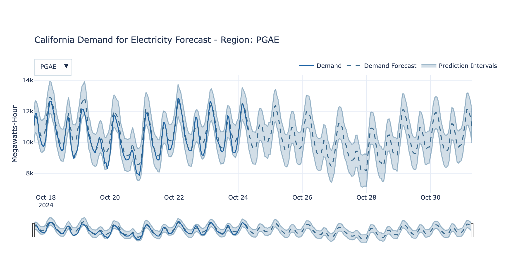

# One Week Forecast of Electricity Demand in California

[Live Dashboard](https://pipegalera.github.io/energy_forecasting/)

This dashboard shows the latest data on electricity demand for the main 4 primary electric utility companies in California:

- Pacific Gas and Electric (PGAE)
- Southern California Edison (SCE)
- San Diego Gas and Electric (SDGE)
- Valley Electric Association (VEA)

## Technologies

- `Data`: US hourly demand for electricity data from EIA API.
- `ML`: The predictions are made using`XGBoost`, trained via `Optuna` for hypertunning, and tracked experiments to select better models via `MLflow`.
- `Automatization`: The data, the forecasting, and the visualization is refreshed daily using a `Docker` image run via `Github Actions`.
- `Visualization`: Plotly.
- `Deployment`: Github pages ([Live Dashboard](https://pipegalera.github.io/energy_forecasting/))

## TO-DO

- [ ] Unit testing.
- [ ] Include MAPE metric within the visualization.
- [ ] Prediction Interval based on bootstrapping. (https://otexts.com/fpp2/bootstrap.html)
